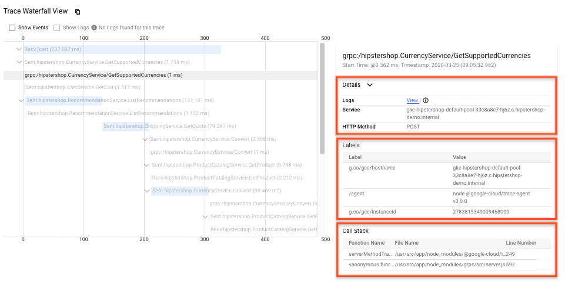

# otel-cloudtrace-renamer
For some reason Google Cloud Trace does not yet support the Tracing Attributes as standardized in [semconv](https://pkg.go.dev/go.opentelemetry.io/otel/semconv).

The attributes shown in the Labels table at https://console.cloud.google.com/traces/list require a very specific format as documented in https://cloud.google.com/trace/docs/trace-labels. This utility wraps the trace exporter for Google Cloud Trace so that you can enjoy using any library and viewing their `semconv` standard attributes from the Google Cloud Trace UI.



# Usage
```golang
import (
	texporter "github.com/GoogleCloudPlatform/opentelemetry-operations-go/exporter/trace"
	renamer "github.com/hermanbanken/otel-cloudtrace-renamer"
)

func main() {
	// Setup tracing
	var exporterTraces sdktrace.SpanExporter
	if exporterTraces, err = texporter.New(); err != nil {
		return errors.Wrap(err, "Failed to create google telemetry exporter")
	}
	exporterTraces = renamer.CloudTraceAttributeRenamer{exporterTraces}
	tp := sdktrace.NewTracerProvider(sdktrace.WithSpanProcessor(exporterTraces))
	otel.SetTracerProvider(tp)

	// [...]
}
```
